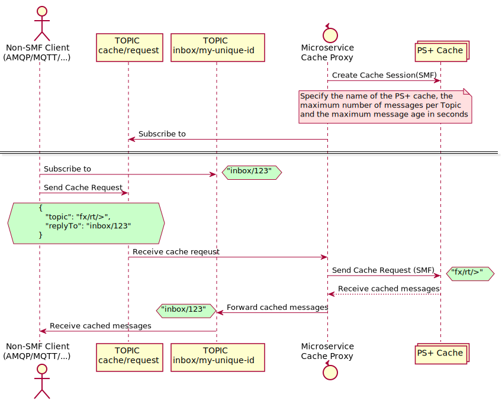

# Cache Proxy

A microservice that acts as a proxy to receive cache requests from non-SMF clients, forwards those requests to the PS+ broker using the SMF protocol, and then forwards the cache reply messages back to the non-SMF clients.

## Configuration

This is a spring boot application, please modify the [./src/main/resources/application.properties](./src/main/resources/application.properties) file according to your environment before compiling, or use the [Command line arguments](https://docs.spring.io/spring-boot/docs/1.4.1.RELEASE/reference/html/boot-features-external-config.html) while running the application.
