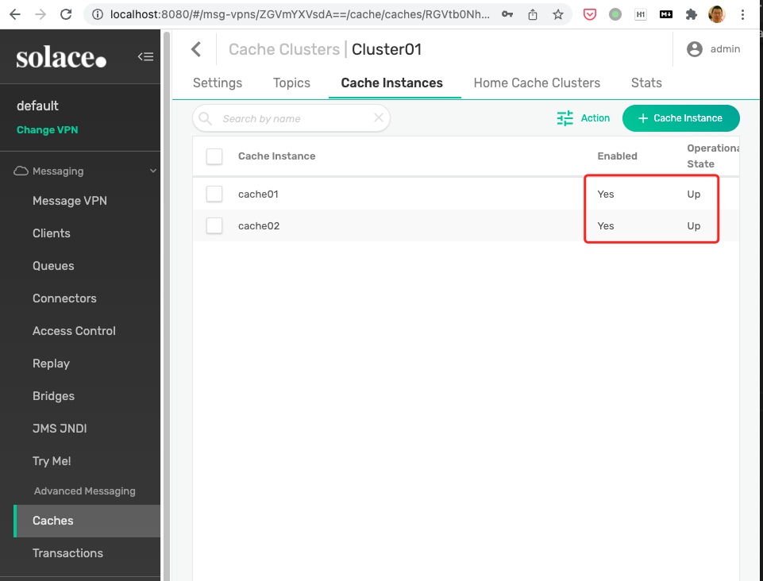
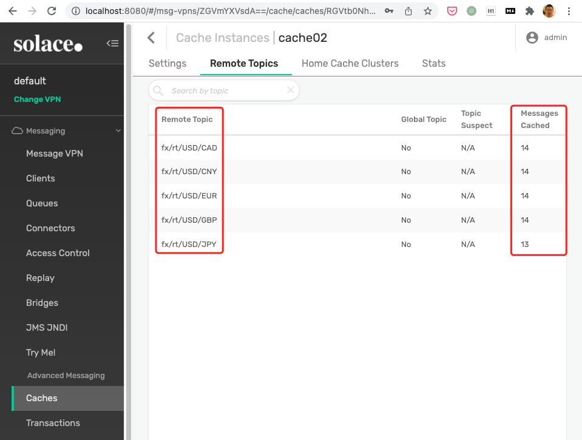

# [Solace PubSub+ Cache](https://docs.solace.com/Solace-PubSub-Cache/PubSub-Cache-Overview.htm) Demo Setup

## Prerequisites

1. [Docker Engine](https://docs.docker.com/engine/)
2. [Docker Compose](https://docs.docker.com/compose/)

## Build Solace PubSub+ Cache Docker Image

1. [Contact Solace](https://docs.solace.com/get-support.htm) to get the PubSub+ Cache installation package and put them under the `./Docker` folder.

```textile
total 35704
-rw-r--r--  1 ichen  staff   813B Mar 15 11:28 Dockerfile
-rwxr-xr-x  1 ichen  staff   377B Mar 15 11:18 docker-build-linux.sh
-rwxr-xr-x  1 ichen  staff   378B Mar 15 10:48 docker-build-macos.sh
-rw-r--r--@ 1 ichen  staff   3.9M Mar 15 09:29 solcache_Linux26-x86_64_opt_7.2.2.20.tar.gz
-rw-r--r--@ 1 ichen  staff    13M Mar 15 08:49 solclient_Linux26-x86_64_opt_7.21.0.5.tar.gz
-rw-r--r--  1 ichen  staff   206B Mar 15 11:11 startCache.sh
```

2. Under folder `./Docker`, run `./docker-build-macos.sh` to build the docker image
3. Verify the image is successfully built.

```textfile
❯ docker image ls island/pspcache
REPOSITORY        TAG       IMAGE ID       CREATED          SIZE
island/pspcache   0.1       d6a9983f4a2e   10 minutes ago   209MB
```

## Start the Solace PubSub+ Cache broker and cache instances

1. run `docker-compose up -d`

```textfile
> docker-compose up -d
Creating network "pspcache_demo_net" with the default driver
Creating cache02 ... done
Creating broker  ... done
Creating cache01 ... done
```

2. Wait until you could log into Solace PS+ manager by accessing http://localhost:8080/ with username `admin` and password `admin`

## Configuring PubSub+ Cache Automatically

1. Install the [solconfig](https://github.com/flyisland/solconfig) first

2. Configure Cache in `default` VPN with [./setup/DefaultVpn.json](./setup/DefaultVpn.json) file.

```text
> java -jar path/to/solconfig.jar -H http://localhost:8080 -u admin -p admin update --no-delete ./setup/DefaultVpn.json
POST /msgVpns/default/clientUsernames OK
POST /msgVpns/default/clientUsernames OK
POST /msgVpns/default/distributedCaches OK
POST /msgVpns/default/distributedCaches/DemoCache/clusters OK
POST /msgVpns/default/distributedCaches/DemoCache/clusters/Cluster01/instances OK
POST /msgVpns/default/distributedCaches/DemoCache/clusters/Cluster01/instances OK
POST /msgVpns/default/distributedCaches/DemoCache/clusters/Cluster01/topics OK
PUT /msgVpns/default/clientUsernames/default OK
```

3. Make sure all the cache instances are enabled and up running.




4. Send some messages to the borker by run `sh ./send-messages.sh`

```text
❯ sh ./send-messages.sh
Sending '2022-03-15-14:31:17' to topic 'fx/rt/USD/EUR'
Sending '2022-03-15-14:31:18' to topic 'fx/rt/USD/GBP'
Sending '2022-03-15-14:31:19' to topic 'fx/rt/USD/CAD'
Sending '2022-03-15-14:31:20' to topic 'fx/rt/USD/CNY'
Sending '2022-03-15-14:31:21' to topic 'fx/rt/USD/JPY'
Sending '2022-03-15-14:31:22' to topic 'fx/rt/USD/EUR'
Sending '2022-03-15-14:31:23' to topic 'fx/rt/USD/GBP'
Sending '2022-03-15-14:31:25' to topic 'fx/rt/USD/CAD'
Sending '2022-03-15-14:31:26' to topic 'fx/rt/USD/CNY'
Sending '2022-03-15-14:31:27' to topic 'fx/rt/USD/JPY'
Sending '2022-03-15-14:31:28' to topic 'fx/rt/USD/EUR'
...
```

5. Now you could find that there are some messages in the cache



## Consume the cached messages

1. To check how to consume the cached messages with SMF java client, please check the [smfcacheclient](../smfcacheclient) project
